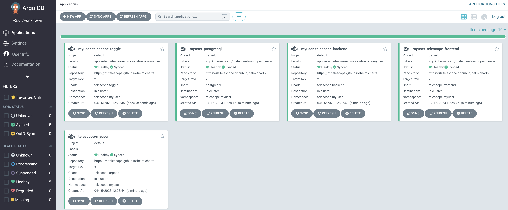
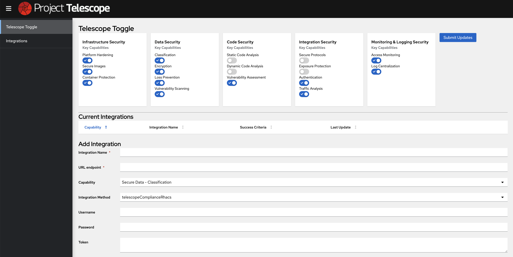
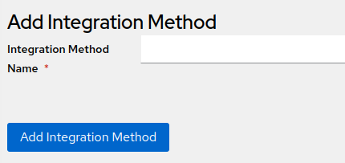
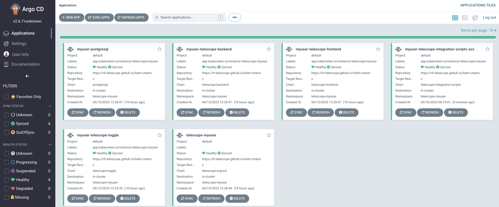

# Adding Integrations

One of the key features of Project Telescope is the ability to assess the security posture of your entire environment which can be visualized in a straightforward manner. Project Telescope enables this capability through the use of _Integrations_. This guide will walk you through the steps of adding your first Integration.

## Prerequisites

Before working through the steps of adding your own integration to Project Telescope, the following requirements must be satisfied:

1. Project Telescope Getting Started Guide Completion
2. [jq](https://stedolan.github.io/jq/)

The [Project Telescope Getting Started Guide](Getting-Started-Guide.md)) must be complete as the steps illustrated in this guide build upon them.

## Introductions to Integrations

An _Integration_ is an external system that provides Security related information that can be consumed and visualized within Project Telescope. The external source must provide a method that Project Telescope can use to obtain information from the remote location. Adding an Integration to Project Telescope involves the following steps:

1. Defining an Integration Method

An _Integration Method_ is used to link integrations to the integration code and provides the string which will be used in the Integration Accessor.  When you create an Integration, you can select the relevant Integration Method to use.

2. Defining an Integration

Creation of an Integration definition within the Project Telescope database with details related to accessing the resource (Endpoint location, credentials, etc)

3. Deploying an Integration Accessor

A process which queries the external component for security related details and stores the results into the Project Telescope database

With an high level understanding of an _Integration_, lets walk through the process of creating a new Integration to obtain security related information from [Red Hat Advanced Cluster Security](https://www.redhat.com/en/technologies/cloud-computing/openshift/advanced-cluster-security-kubernetes).

## Adding an Integration for Red Hat Advanced Cluster Security

Red Hat Advanced Cluster Security is a Kubernetes-native security platform equipping organizations to more securely build, deploy, and run cloud-native applications. Information that it collects can be brought into Project Telescope to aid in the assessment of security enforcement within an organization.

### Prerequisites

The following must be completed before the integration can be completed:

1. Ensure required environment variable have been defined defined

If the `INSTANCE_NAME` and `APPS_SUBDOMAIN` environment variable have yet to be defined, execute the following and ensure the names that were used as part of the Getting Started Guide match.

```shell
export APPS_SUBDOMAIN=apps.$(oc get dns cluster -o jsonpath='{ .spec.baseDomain }')
export INSTANCE_NAME=myuser
```

2. Deployment of the [Compliance Operator](https://docs.openshift.com/container-platform/latest/security/compliance_operator/compliance-operator-understanding.html)

The Compliance Operator enables platform administrators to describe the required compliance posture along with remedying gaps that might be currently present.

Ensure that the Compliance Operator has been deployed to the same cluster as Red Hat Advanced Cluster Security.

3. Deployment of Red Hat Advanced Cluster Security along with access to create [API Tokens](https://docs.openshift.com/acs/3.74/integration/integrate-with-ci-systems.html#cli-authentication_integrate-with-ci-systems)

Ensure a deployment of Red Hat Advanced Cluster Security is available an accessible from Project Telescope. The steps in this guide assume that Red Hat Advanced Cluster Security has been deployed to the same cluster as Project Telescope and the current user has administrative access to both the OpenShift Cluster and Red Hat Advanced Cluster Security.

The [Appendix](#appendix) section provides a set of Argo CD Applications to deploy and configure the required prerequisites outlined in this section.

### Deploying Telescope Toggle

[Telescope Toggle](https://github.com/RH-Telescope/telescope-toggle) is a management and utility application that can be used to not only demonstrate certain features, but allow for managing Integrations. It can be deployed using Argo CD by modifying the existing `telescope-$INSTANCE_NAME` Application.

Execute the following to update the Application to deploy the Telescope Toggle Application:

```shell
cat <<EOF | envsubst | oc apply --server-side=true  -f -
apiVersion: argoproj.io/v1alpha1
kind: Application
metadata:
  name: telescope-$INSTANCE_NAME
  namespace: openshift-gitops
spec:
  source:
    helm:
      values: |
        applicationPrefix: $INSTANCE_NAME
        charts:
          telescope-frontend:
            values:
              backendUrl: https://telescope-backend-telescope-$INSTANCE_NAME.$APPS_SUBDOMAIN
          telescope-toggle:
            enabled: true
EOF
```

Navigate to the Argo CD user interface and ensure all of the applications are healthy as shown in the depiction below:



Once Telescope Toggle has been deployed, obtain the URL of the exposed endpoint:

```shell
echo https://$(oc get route telescope-toggle -n telescope-$INSTANCE_NAME -o jsonpath='{.spec.host}')
```

Navigate to the URL obtained above to access the Telescope Toggle user interface:



### Accessing Red Hat Advanced Cluster Security from Project Telescope

The Project Telescope Integration must be able to query Red Hat Advanced Cluster Security in order to obtain security related information. To do so, the URL and credentials for the endpoint must be obtained from Red Hat Advanced Cluster Security so that it can be stored in the Project Telescope Database. Use the following steps to obtain the necessary information:

Authenticate to the OpenShift cluster as a `cluster-admin` and obtain the Red Hat Advanced Cluster Security _admin_ password:

```shell
export ACS_PASSWORD=$(oc get secret -n stackrox central-htpasswd -o jsonpath='{ .data.password }' | base64 -d)
```

Next, locate the endpoint for Red Hat Advanced Cluster Security:

```shell
export ACS_ENDPOINT=$(oc get route central -n stackrox -o jsonpath='{.spec.host}')
```

Print out the endpoint for Red Hat Advanced Cluster Security as it will be needed later on

```shell
echo https://$ACS_ENDPOINT
```

Create a new API Token to allow the Project Telescope Integration to query information from Red Hat Advanced Cluster Security:

```shell
export ACS_TELESCOPE_TOKEN=$(curl -sk -X POST -u admin:$ACS_PASSWORD https://$ACS_ENDPOINT/v1/apitokens/generate -d "{\"name\":\"telescope-$INSTANCE_NAME\",\"role\":null,\"roles\":[\"Admin\"]}" | jq -r .token)
```

Ensure the prior command was successful and a token was created successfully

```shell
echo $ACS_TELESCOPE_TOKEN
```

### Obtaining the Cluster ID

The Cluster ID of the OpenShift cluster is used to instruct Red Hat Advanced Cluster Security to initiate a scan on a particular environment. It can be obtained by executing the following:

```shell
export OCP_CLUSTER_ID=$(curl -ks -u admin:$ACS_PASSWORD "https://$ACS_ENDPOINT/v1/clusters" | jq -r '.clusters[] | select(.name=="local-cluster") | .id')
```

_Note_: The above command assumes that the OpenShift environment is named `local-cluster`. Update the query to target the desired cluster.

### Performing CIS Scanning Using the Compliance Operator

The Compliance Operator can be used to scan various resources within an OpenShift environment in order to attest whether they comply with a variety of _Profiles_. Two CIS profiles, `ocp4-cis` and `ocp4-cis-node` are installed by default . Use the Compliance Operator to perform a scan of the OpenShift environment based on the policies defined within these profiles.

```shell
cat <<EOF | envsubst | oc apply -f -
apiVersion: compliance.openshift.io/v1alpha1
kind: ScanSettingBinding
metadata:
  name: cis-compliance
  namespace: openshift-compliance
profiles:
  - name: ocp4-cis-node
    kind: Profile
    apiGroup: compliance.openshift.io/v1alpha1
  - name: ocp4-cis
    kind: Profile
    apiGroup: compliance.openshift.io/v1alpha1
settingsRef:
  name: default
  kind: ScanSetting
  apiGroup: compliance.openshift.io/v1alpha1
EOF
```

### Triggering a Scan of the OpenShift Environment from Red Hat Advanced Cluster Security

Once the Compliance Operator has been configured to perform CIS scanning of OpenShift, trigger a new scan of the OpenShift cluster by Red Hat Advanced Cluster Security

```shell
export SCAN_RUN_ID=$(curl -sk -X POST -u admin:$ACS_PASSWORD https://$ACS_ENDPOINT/v1/compliancemanagement/runs -d '{"selection": { "clusterId": "'"$OCP_CLUSTER_ID"'", "standardId": "'"ocp4-cis"'" }}' | jq -r '.startedRuns[0].id')
```

With the scan started, wait until it completes.

```shell
until [ "$(curl -sk -u admin:$ACS_PASSWORD https://$ACS_ENDPOINT/v1/complianceManagement/runs | jq -r '.complianceRuns[]|select(.id=="'"$SCAN_RUN_ID"'") | .state')" = "FINISHED" ]; do echo -n "."; sleep 1; done
```
### Adding an Integration Method using Telescope Toggle
Before adding a new Integration, you will need to add an _Integration Method_.  Once created, the name of the Integration Method and Id will be linked to your integration when added.



When added, the new Integration Method will be visible in the Integration Methods drop-down list.


### Adding the Integration using Telescope Toggle

Telescope Toggle can now be used to add the _Integration_ for Red Hat Advanced Cluster Security. Navigate to the Telescope Toggle user interface and browse to the _Integrations_ section. Take note of the required properties, specifically the _URL Endpoint_. This property references the endpoint that is exposing the security related data from the external tool. In the case of Red Hat Advanced Cluster Security, the endpoint relates to _runresults_ of the `ocp4-cis` standard. It can be obtained by executing the following command:

```shell
export OCP4_RUN_RESULTS="https://$ACS_ENDPOINT/v1/compliance/runresults?standardId=ocp4-cis&clusterId=$OCP_CLUSTER_ID"
```

Enter the following values into the _Add Integration_ form using the variables obtained in the prior sections:

Integration Name: **RHACS Compliance Score**
URL Endpoint: `$OCP4_RUN_RESULTS`
Token: `$ACS_TELESCOPE_TOKEN`
Success Criteria: **80**

Click **Add Integration** to add the integration for Red Hat Advanced Cluster Security to the Project Telescope Database

### Adding an Integration Synchronizer

Once an integration has been defined in the Project Telescope database, security related information can be obtained from external sources. However, the core capabilities of Project Telescope do not include features which enable the querying of these resources. This is where an Integration Synchronizer comes in and includes the necessary logic to communicate with the external source and store results within Project Telescope so that it can be exposed. In the case of Red Hat Advanced Cluster Security, the Integration Synchronizer is a _CronJob_.

The `telescope-$INSTANCE_NAME` Argo CD Application can be updated to include the Integration Synchronizer for Red Hat Advanced Cluster Security:

```shell
cat <<EOF | envsubst | oc apply --server-side=true  -f -
apiVersion: argoproj.io/v1alpha1
kind: Application
metadata:
  name: telescope-$INSTANCE_NAME
  namespace: openshift-gitops
spec:
  source:
    helm:
      values: |
        applicationPrefix: $INSTANCE_NAME
        charts:
          telescope-frontend:
            values:
              backendUrl: https://telescope-backend-telescope-$INSTANCE_NAME.$APPS_SUBDOMAIN
          telescope-toggle:
            enabled: true
          telescope-integration-scripts:
            enabled: true
            name: telescope-integration-scripts-acs
            repoChart: telescope-integration-scripts
            releaseName: telescope-integration-scripts-acs
            values:
              image: quay.io/telescope/telescope-integration-scripts-acs:latest
              schedule: '* * * * *'
EOF
```

The above definition will deploy a new Helm chart called `telescope-integration-scripts` and created a new Argo CD application called _telescope-integration-scripts-acs_ and can be seen in the Argo CD user interface as shown below:



You might have noticed in the above Argo CD application definition that the `schedule` value was set. While we would not want an Integration to query an external endpoint every minute, it provides a method for confirming that the Integration is performing as expected.

After waiting 1 minute, view the logs from the spawned pod created by the CronJob and confirm that no errors are displayed.

```shell
oc logs -f $(oc get pods -n $INSTANCE_NAME -o json | jq -r '.items[].metadata.name | select (. | startswith("telescope-integration-scripts"))'
```

## Appendix

To support the process for adding a new integration to Project Telescope, this section provide supplemental resources to simplify the process for ensuring prerequisites are met. Many of the assets leverage the [gitops-catalog](https://github.com/redhat-cop/gitops-catalog), a declarative toolkit for implementing GitOps Practices on OpenShift, from the Red Hat Community of Practice.

_Note_: While the Argo CD Applications for Project Telescope itself are designed to support a Multitenant style deployment, the resources within this section are designed to be deployed only once to a single cluster.

### Compliance Operator

Deploy the Compliance Operator by adding the following Argo CD Application


```shell
cat <<EOF | envsubst | oc apply -f -
apiVersion: argoproj.io/v1alpha1
kind: Application
metadata:
  annotations:
    argocd.argoproj.io/sync-options: SkipDryRunOnMissingResource=true
    argocd.argoproj.io/compare-options: IgnoreExtraneous
  name: compliance-operator
  namespace: openshift-gitops
spec:
  destination:
    namespace: openshift-gitops
    server: https://kubernetes.default.svc
  project: default
  source:
    path: compliance-operator/operator/overlays/release-0.1
    repoURL: https://github.com/redhat-cop/gitops-catalog.git
    targetRevision: main
  syncPolicy:
    automated:
      selfHeal: true
    retry:
      limit: 20
      backoff:
        duration: 10s
        factor: 2
        maxDuration: 20m
EOF
```

### Red Hat Advanced Cluster Security

Red Hat Advanced Cluster Security can be configured to support a multitude of environments and patterns. However, to perform a default deployment and configuration of the project, add the following Argo CD Application to deploy the Central component along with adding the hosting cluster as cluster within the product.


```shell
cat <<EOF | envsubst | oc apply -f -
apiVersion: argoproj.io/v1alpha1
kind: Application
metadata:
  annotations:
    argocd.argoproj.io/sync-options: SkipDryRunOnMissingResource=true
    argocd.argoproj.io/compare-options: IgnoreExtraneous
  name: advanced-cluster-security
  namespace: openshift-gitops
spec:
  destination:
    namespace: openshift-gitops
    server: https://kubernetes.default.svc
  project: default
  source:
    path: advanced-cluster-security-operator/aggregate/default
    repoURL: https://github.com/redhat-cop/gitops-catalog.git
    targetRevision: main
  syncPolicy:
    automated:
      selfHeal: true
    retry:
      limit: 20
      backoff:
        duration: 10s
        factor: 2
        maxDuration: 20m
EOF
```
