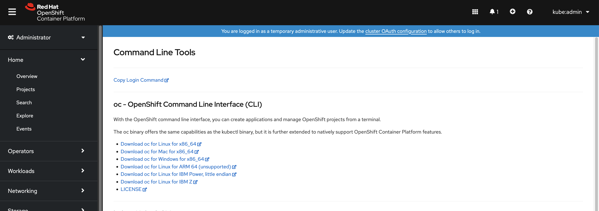

# Getting Started with Project Telescope

This guide introduces you to the components that are included as part of Project Telescope as well as deployment to a Kubernetes or OpenShift environment. Given that the deployment of Project Telescope will utilize two separate runtime environments, this guide will be broken down based on those two deployment targets. 

## Architecture

Project Telescope includes two primary components:

* Backend - Interfaces with various security tools and exposes the current compliance posture via a RESTful API.
* Frontend - User interface enabling the visualization of the current level of compliance by exposed by the backend service.

Supporting these applications are a set of [Helm](https://helm.sh) charts along with integrations to [Argo CD](https://argo-cd.readthedocs.io) which simplifies the deployment a Kubernetes environment.

## Pre-requisites:

The following must be satisfied prior to deploying Project Telescope:

* A Kubernetes ([minikube](https://minikube.sigs.k8s.io)/[kind](https://kind.sigs.k8s.io)/self managed/managed) or an OpenShift 4.10+ Cluster with elevated permissions to install and manage resources at a cluster level.

Additional integrations are also needed to support this walkthrough which will be described in the sections below

##  CLI Tools

In order to integrate with the associated resources in use within this guide, several command line tools must be installed and configured.

### Kubernetes

`kubectl` is the command line tool for interacting with a Kubernetes environment. The CLI can be downloaded from the [Kubernetes project website](https://kubernetes.io/docs/tasks/tools/#kubectl) with separate installation steps depending on the target operating system.

### OpenShift

`oc` is the command line tool for interacting with OpenShift environments and can be installed several different methods depending on the target operating system. The installation of the `oc` tool is required when deploying to an OpenShift environment.

#### Binary Installation

The OpenShift CLI binary can be installed on Linux, OSX or Windows based machines and can be obtained from two primary sources:

1. [Red Hat Console](https://console.redhat.com)
2. The OpenShift Web Console.

To use the OpenShift Web Console as a method for obtaining the CLI, launch the web console and click the question mark dropdown on the toolbar. 


Select _Command Line Tools_.



Select the appropriate resource depending on your Operating System.

Once the download has completed, unpack the archive. On a Linux or OSX machine, the archive can be extracted using the following command:

```shell
tar xvzf <file>
```

Move the `oc` binary to a location that is on your `PATH`

#### RPM (RHEL 8)

To download the OpenShift CLI on a Red Hat Enterprise Linux 8 machine, ensure the appropriate repository is enabled and install the CLI from the `openshift-clients` package.

```shell
sudo subscription-manager repos --enable="rhocp-4.12-for-rhel-8-x86_64-rpms"
sudo yum install openshift-clients
```

NOTE: Ensure that you enable the appropriate repository corresponding to the OpenShift version for the target cluster being used.

### Authenticating

Kubernetes and OpenShift have two different authentication methods. Use the following sections based on the deployment environment to authenticate to the platform in use

#### Kubernetes

#### Authenticating to Kubernetes

Consult the [Kubernetes project documentation](https://kubernetes.io/docs/reference/access-authn-authz/authentication) or applicable material for the specific Kubernetes environment in use.

#### Authenticating to OpenShift

The simplest method for authenticating the OpenShift CLI is to obtain the login command from the Web Console.

Navigate to the OpenShift Web Console, select the name of the currently authenticated user at the top righthand corner and select **Copy Login Command**. You may be requested to auhenticate once again.

Select the **Display Token** link and copy the provided command underneath the _Log in with this token_ section. Paste the command into the command line to authenticate the CLI. 

### Argo CD

Project Telescope can be deployed using Argo CD / OpenShift GitOps. To interact with the Argo CD server, the `argocd` CLI is used.

Several methods are available for installing Argo CD as listed within the [project documentation](https://argo-cd.readthedocs.io/en/stable/cli_installation/).

Follow the steps as described within the documentation to install the Argo CD CLI to your local machine.

## Argo CD Installation

With the installation of the Argo CD CLI to a local machine as described in the prior section, Argo CD itself should be deployed to the target environment.

### Upstream Argo CD (Kubernetes Deployment)

Multiple methods are available to install Argo CD and including Helm, an Operator, or raw manifest as described in the [Argo CD installation documentation](https://argo-cd.readthedocs.io/en/stable/getting_started). Since there will not be a need to customize the configuration of Argo CD for the purpose of this tutorial, raw manifests will be used for this guide.

Using the steps for installing Argo CD using raw manifests as described in the Argo CD documentation, execute the following command to deploy the tool:

```shell
kubectl create namespace argocd
kubectl apply -n argocd -f https://raw.githubusercontent.com/argoproj/argo-cd/stable/manifests/install.yaml
```

When using the raw manifests, Argo CD is deployed with the necessary permissions to manage resources across a Kubernetes cluster.

An `admin` user is available to manage Argo CD using either the CLI or the web console. The initial password is stored in a secret named `argocd-initial-admin-secret` within the _argocd_ namespace and can be obtained by executing the following command:

```shell
kubectl -n argocd get secret argocd-initial-admin-secret -o jsonpath="{.data.password}" | base64 -d
```

The value obtained will be needed later on when deploying Project Telescope.

### OpenShift GitOps

OpenShift cluster. The installation is facilitated using the OperatorHub and can be completed with only a few clicks.

Navigate to OpenShift Web Console and within the _Administrator Perspective_, expand **Operators** and then select **OperatorHub**.

Search for **OpenShift GitOps** and select the tile when it appears.

.

Click **Install**.

Select the desired Update Channel, approval strategy and then click **Install** to install the OpenShift GitOps Operator.

.

Once the operator has been deployed, all of the related resources will be configued within the `openshift-gitops` namespace.

While OpenShift GitOps can operate either at a cluster scoped level or in a namespaced scoped (tenant) level, for the purpose of this guide, it will be configured to operate across any OpenShift namespace within the cluster.

Grant the Argo CD Service Account's for the Application and ApplicationSet controller `cluster-admin` privileged

```shell
oc apply -f - <<EOF
apiVersion: rbac.authorization.k8s.io/v1
kind: ClusterRoleBinding
metadata:
  name: openshift-gitops-cluster-admin
roleRef:
  apiGroup: rbac.authorization.k8s.io
  kind: ClusterRole
  name: cluster-admin
subjects:
- kind: ServiceAccount
  name: openshift-gitops-argocd-application-controller
  namespace: openshift-gitops
- kind: ServiceAccount
  name: openshift-gitops-applicationset-controller
  namespace: openshift-gitops
EOF
```

Note: Elevated permissions, such as `cluster-admin` simplifies how OpenShift can manage resources across the entire cluster. However, it is recommended that policies be defined that restrict the permissions that are granted to align with the _Privilege of Least Principle_, which are outside the scope of this guide.

Finally, grant any authenticated user to the Argo CD web console _admin_ access by patching the `ArgoCD` resource using the following command:

```shell
oc apply --server-side=true --force-conflicts -f - <<EOF
apiVersion: argoproj.io/v1beta1
kind: ArgoCD
metadata:
  name: openshift-gitops
  namespace: openshift-gitops
spec:
  rbac:
    defaultPolicy: 'role:admin'
EOF
```

## Ingress

Since Project Telescope consists and exposes a web based application, a method for ingresting HTTP based traffic must be available. For OpenShift based deployments, the platform already includes a HAProxy based Ingress Controller. For Kubernetes environments, a compatible [Ingress Controller](https://kubernetes.io/docs/concepts/services-networking/ingress-controllers) must be deployed and available. A suggested option is to leverage the [NGINX Kubernetes Ingress Controller](https://www.nginx.com/products/nginx-ingress-controller).

## Deploying Project Telescope

Project Telescope supports multiple deployment paradigms and can either be installed to support a single cluster based deployment or in an tenant scope mode where multiple instances of Project Telescope can be deployed to a single cluster.

Given that Project Telescope embraces secure practices, this guide will describe the process of leveraging Project Telescope in a multitenant fashion.

As mentioned previously, this section will be broken down based on the two types of environments: Kubernetes or OpenShift

### Kubernetes

Utilize this section to deploy Project Telescope to a Kubernetes environment

### Set Required Variables

Before deploying Project Telescope, several environment variables will need to be defined as they play a role in the configuration.

First, set an environment variable called `APPS_SUBDOMAIN` to refer to a routable DNS subdomain to your ingress controller. Set the environment variable to the DNS subdomain:

```shell
export APPS_SUBDOMAIN=<DNS_DUBDOMAIN>
```

Next, to support the multitenant model, specify a unique instance name (such as your username). In this guide, `myuser` will be the name specified. Set the environment variable `INSTANCE_NAME` to the desired value:

```shell
export INSTANCE_NAME=myuser
```

Finally, set the name of the [Ingress Class](https://kubernetes.io/docs/concepts/services-networking/ingress/#ingress-class) for the Ingress Controller available in the environment. For example, if the NGINX Kubernetes Ingress Controller was used, `nginx` is most likely the name of the Ingress Class. This can be confirmed by executing the following command to list all of the configured Ingress Classes.

```shell
kubectl get ingressclass
```

Set an environment variable `INGRESS_CLASS` to the value of the desired Ingress Class

```shell
export INGRESS_CLASS=<INGRESS_CLASS>
```

### Deploying Project Telescope Using Argo CD

As previously indicated, Project Telescope makes use of a series of Helm charts to streamline how Project Telescope is deployed and configured. These charts are located in the [helm-charts](https://github.com/RH-Telescope/helm-charts) repository within the [RH-Telescope](https://github.com/RH-Telescope) GitHub organization.

Charts are available for each of the primary Project Telescope components (frontend and backand). An additional chart is also available to support a deployment of the entire stack using Argo CD.

The `telescope-argocd` chart leverages an Argo CD [App of Apps Pattern](https://argo-cd.readthedocs.io/en/stable/operator-manual/cluster-bootstrapping) which in the process deploys the following charts:

* Frontend
* Backend
* PostgreSQL database supporting the backend

Bootstrapping Project Telescope can be completed with one simple command to define an Argo CD `Application` to deploy the Project Telescope Argo CD Helm Chart to a new namespace called `telescope-${INSTANCE_NAME}` 

Ensure the previously defined variables are still present and execute the following command to create the Argo CD _Application_ to deploy Project Telescope:

```shell
cat <<EOF | envsubst | oc apply -f -
apiVersion: argoproj.io/v1alpha1
kind: Application
metadata:
  finalizers:
    - resources-finalizer.argocd.argoproj.io
  name: $INSTANCE_NAME-telescope
  namespace: argocd
spec:
  destination:
    namespace: telescope-$INSTANCE_NAME
    server: 'https://kubernetes.default.svc'
  project: default
  source:
    chart: telescope-argocd
    helm:
      values: |
        applicationPrefix: $INSTANCE_NAME
        charts:
          postgresql:
            enabled: true
          telescope-backend:
            enabled: true
            values:
              ingress:
                host: telescope-backend-telescope-$INSTANCE_NAME.$APPS_SUBDOMAIN
                className: $INGRESS_CLASS
          telescope-frontend:
            enabled: true
            values:
              backendUrl: https://telescope-backend-telescope-$INSTANCE_NAME.$APPS_SUBDOMAIN
              ingress:
                host: telescope-frontend-telescope-$INSTANCE_NAME.$APPS_SUBDOMAIN
                className: $INGRESS_CLASS
    repoURL: 'https://rh-telescope.github.io/helm-charts'
    targetRevision: x
  syncPolicy:
    automated:
      selfHeal: true
    syncOptions:
    - CreateNamespace=true
EOF
```

### OpenShift

Utilize this section to deploy Project Telescope to an OpenShift environment

### Set Required Variables

Before deploying Project Telescope, several environment variables will need to be defined as they play a role in the configuration.

First, set an environment variable called `APPS_SUBDOMAIN` by executing the following command:

```shell
export APPS_SUBDOMAIN=apps.$(oc get dns cluster -o jsonpath='{ .spec.baseDomain }')
```

Next, to support the multitenant model, specify a unique instance name (such as your username). In this guide, `myuser` will be the name specfied. Set the environment variable `INSTANCE_NAME` to the desired value:

```shell
export INSTANCE_NAME=myuser
```

### Deploying Project Telescope Using Argo CD

As previously indicated, Project Telescope makes use of a series of Helm charts to streamline how Project Telescope is deployed and configured. These charts are located in the [helm-charts](https://github.com/RH-Telescope/helm-charts) repository within the [RH-Telescope](https://github.com/RH-Telescope) GitHub organization.

Charts are available for each of the primary Project Telescope components (frontend and backand). An additional chart is also available to support a deployment of the entire stack using Argo CD.

The `telescope-argocd` chart leverages an Argo CD [App of Apps Pattern](https://argo-cd.readthedocs.io/en/stable/operator-manual/cluster-bootstrapping) which in the process deploys the following charts:

* Frontend
* Backend
* PostgreSQL database supporting the backend

Bootstrapping Project Telescope can be completed with one simple command to define an Argo CD `Application` to deploy the Project Telescope Argo CD Helm Chart to a new namespace called `telescope-${INSTANCE_NAME}` 

Ensure the previously defined variables are still present and execute the following command to create the Argo CD _Application_ to deploy Project Telescope:

```shell
cat <<EOF | envsubst | oc apply -f -
apiVersion: argoproj.io/v1alpha1
kind: Application
metadata:
  finalizers:
    - resources-finalizer.argocd.argoproj.io
  name: telescope-$INSTANCE_NAME
  namespace: openshift-gitops
spec:
  destination:
    namespace: telescope-$INSTANCE_NAME
    server: 'https://kubernetes.default.svc'
  project: default
  source:
    chart: telescope-argocd
    helm:
      values: |
        applicationPrefix: $INSTANCE_NAME
        gitOpsNamespace: openshift-gitops
        charts:
          postgresql:
            enabled: true
            valueFiles:
              - values-openshift.yaml
          telescope-backend:
            enabled: true
            values:
              ingress:
                host: telescope-backend-telescope-$INSTANCE_NAME.$APPS_SUBDOMAIN
            valueFiles:
              - values-openshift.yaml
          telescope-frontend:
            values:
              backendUrl: https://telescope-backend-telescope-$INSTANCE_NAME.$APPS_SUBDOMAIN
              ingress:
                host: telescope-frontend-telescope-$INSTANCE_NAME.$APPS_SUBDOMAIN
            valueFiles:
              - values-openshift.yaml
    repoURL: 'https://rh-telescope.github.io/helm-charts'
    targetRevision: x
  syncPolicy:
    automated:
      selfHeal: true
    syncOptions:
    - CreateNamespace=true
EOF
```

## Verifying the Deployment

There are multiple methods for which the deployment of Project Telescope can be verified.

#### Using Command Line tools

First, use either `kubectl` or the OpenShift Command Line (`oc`) depending on the operating environment to verify each of the `Applications` have been created and are healthy.

For Kubernetes, execute the following command:

```shell
kubectl get applications -n argocd
```

For OpenShift, execute the following command:

```shell
oc get applications -n openshift-gitops
```

Regardless of the deployment environment, the result should display four (4) total applications, each with a _Health Status_ of _Healthy_ as shown below.

```shell
NAME                        SYNC STATUS   HEALTH STATUS
myuser-postgresql           Synced        Healthy
myuser-telescope            Synced        Healthy
myuser-telescope-backend    Synced        Healthy
myuser-telescope-frontend   Synced        Healthy
```

#### Using the Argo CD Web Console

The Argo CD _Applications_ that were deployed can be visualized using the Argo CD Web Console.

Access to the Argo CD Web Console depends based on the operating environment. For Kubernetes, access can be granted through the Ingress Controller, or the `kubectl port-forward` command can be used.

For OpenShift based deployments, the Argo CD Web Console address can be obtained by executing the following command:

```shell
echo https://$(oc get route openshift-gitops-server -n openshift-gitops -o jsonpath='{.spec.host}{"\n"}')
```

Navigate to the URL displayed.

Authenticating to the web console also depends on the target environment. For Upstream Argo CD, the credentials for the admin user were obtained previously and can be used to assess the console. For OpenShift GitOps, authenticate to Argo CD by selecting the **Log In Via OpenShift** button and enter your OpenShift credentials. 

Once authenticated, you will be presented with a dashboard of the deployed Argo CD applications which will appear similar to the following:


Take note that all _Applications_ are Synchronized and Healthy.

#### Using the Argo CD CLI

Alternately, instead of using the Argo CD Web Console to visualize the state of the Project Telescope _Applications_, the Argo CD CLI installed previously can be used.

For Upstream Argo CD, the following command can be used:

```shell
argocd login --core
```

For OpenShift GitOps, execute the following command to initiate the authentication process:

```shell
argocd login --insecure --grpc-web $(oc get route openshift-gitops-server -n openshift-gitops -o jsonpath='{.spec.host}') --sso
```

A web browser will be launched so that the authentication process can be completed. Enter your OpenShift credentials to authenticate the Argo CD CLI. Close the browser upon completion of the authentication process.

Use the Argo CD CLI to view the list of list of applications which will present a similar output as the CLI, but be enriched with additional properties as shown below:

```shell
argocd app list
```

```shell
myuser-postgresql          https://kubernetes.default.svc  telescope-myuser  default  Synced  Healthy  Auto        <none>      https://rh-telescope.github.io/helm-charts        x
myuser-telescope           https://kubernetes.default.svc  telescope-myuser  default  Synced  Healthy  Auto        <none>      https://rh-telescope.github.io/helm-charts        x
myuser-telescope-backend   https://kubernetes.default.svc  telescope-myuser  default  Synced  Healthy  Auto        <none>      https://rh-telescope.github.io/helm-charts        x
myuser-telescope-frontend  https://kubernetes.default.svc  telescope-myuser  default  Synced  Healthy  Auto        <none>      https://rh-telescope.github.io/helm-charts        x
```

## Accessing the Project Telescope Frontend

With the verification process complete, access the Project Telescope frontend in a web browser. The location can be found by executing the following command:

```shell
echo https://$(kubectl get ingress telescope-frontend -n telescope-$INSTANCE_NAME -o jsonpath='{ .spec.rules[*].host }')
```

NOTE: Replace `kubectl` with `oc` if OpenShift is the target environment.

Explore the current status of the security posture of your environment:


Congratulations! You have completed deploying Project Telescope to your Kubernetes or OpenShift environment using tools including Helm and Argo CD!

Additional guides coming soon!
